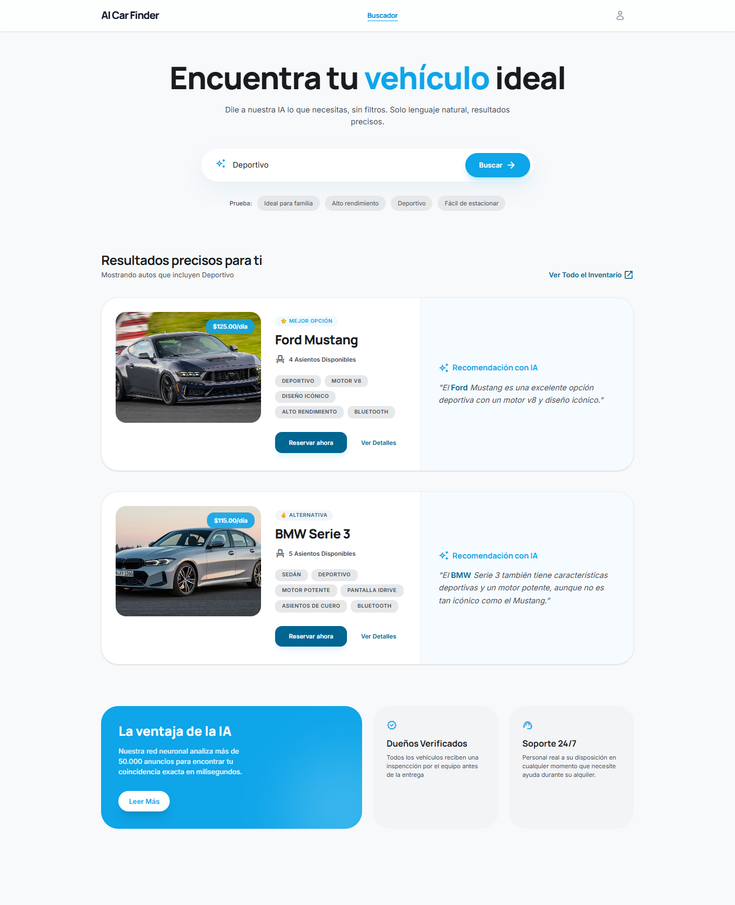

# AI Car Finder 🚗🤖

Aplicación que permite buscar vehículos usando lenguaje natural.  
Describe lo que necesitas y la IA encontrará las mejores opciones para ti.

---

## ✨ Características

- 🔍 Búsqueda con lenguaje natural
- 🤖 Interpretación inteligente de necesidades
- 🧠 Recomendaciones personalizadas con IA
- ⚡ Resultados rápidos y relevantes

---

---

## 🛠️ Tecnologías

- React + Vite + Tailwind  
- Integración con API de IA (Groq)  
- Backend en Laravel  
- Base de datos MySQL  

---

## 🧠 ¿Qué hace diferente a esta app?

En lugar de usar filtros tradicionales, el usuario puede escribir lo que necesita, por ejemplo:

> "Quiero un auto familiar, económico y con aire acondicionado"

La aplicación interpreta la intención y devuelve resultados relevantes junto con una explicación personalizada.

---

## 📷 Screenshot

---

## ⚙️ Backend

La lógica de filtrado y procesamiento se encuentra en el backend:

👉 [AI Car Finder Backend](https://github.com/Deiver221/ai-car-finder-backend)

---

## 📌 Notas

Este proyecto fue desarrollado como parte de un portafolio para demostrar el uso de IA en aplicaciones reales enfocadas en mejorar la experiencia de búsqueda.
